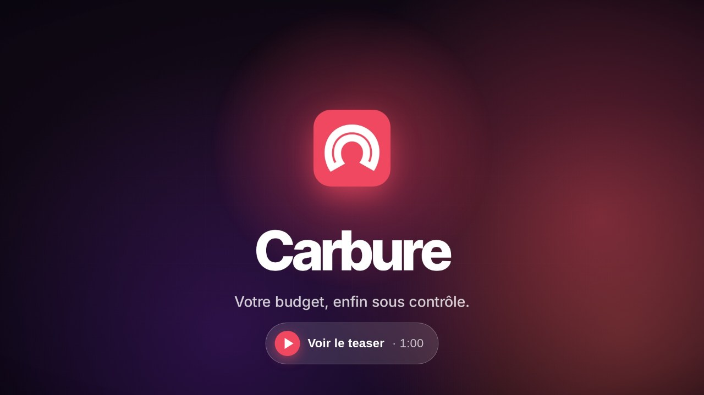
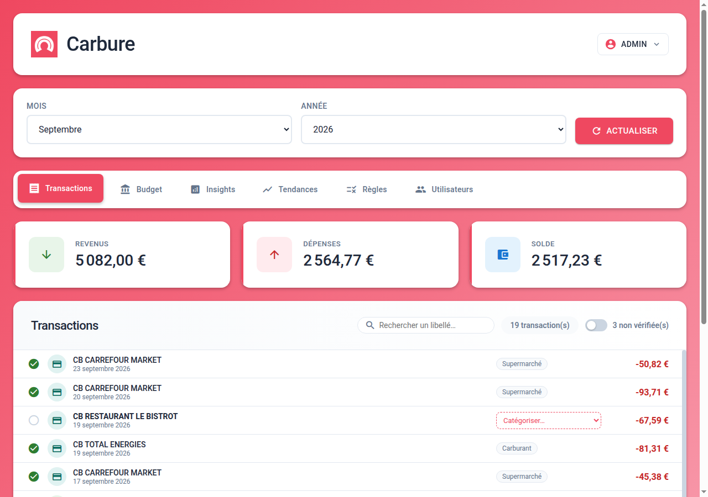
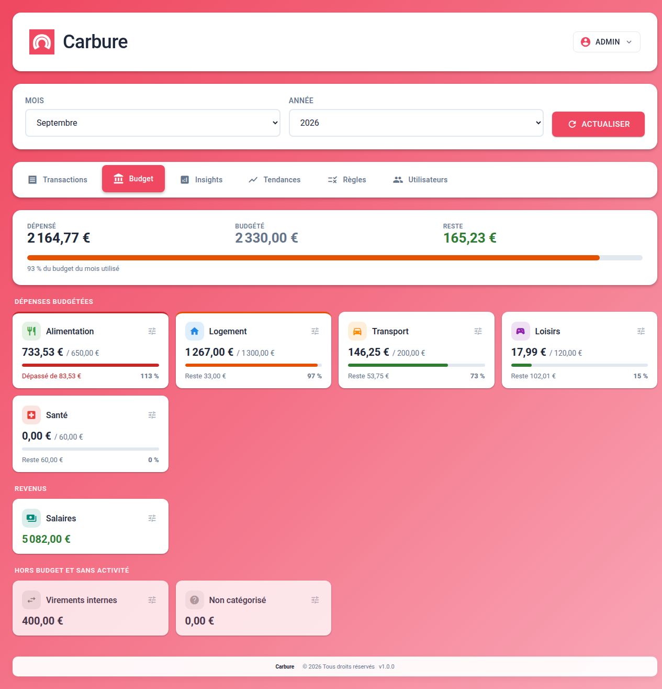
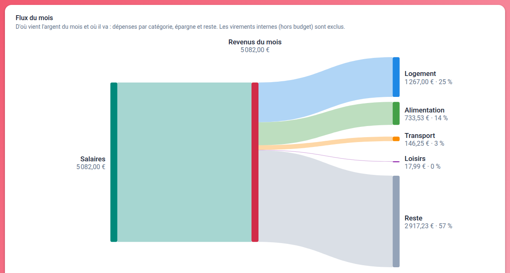
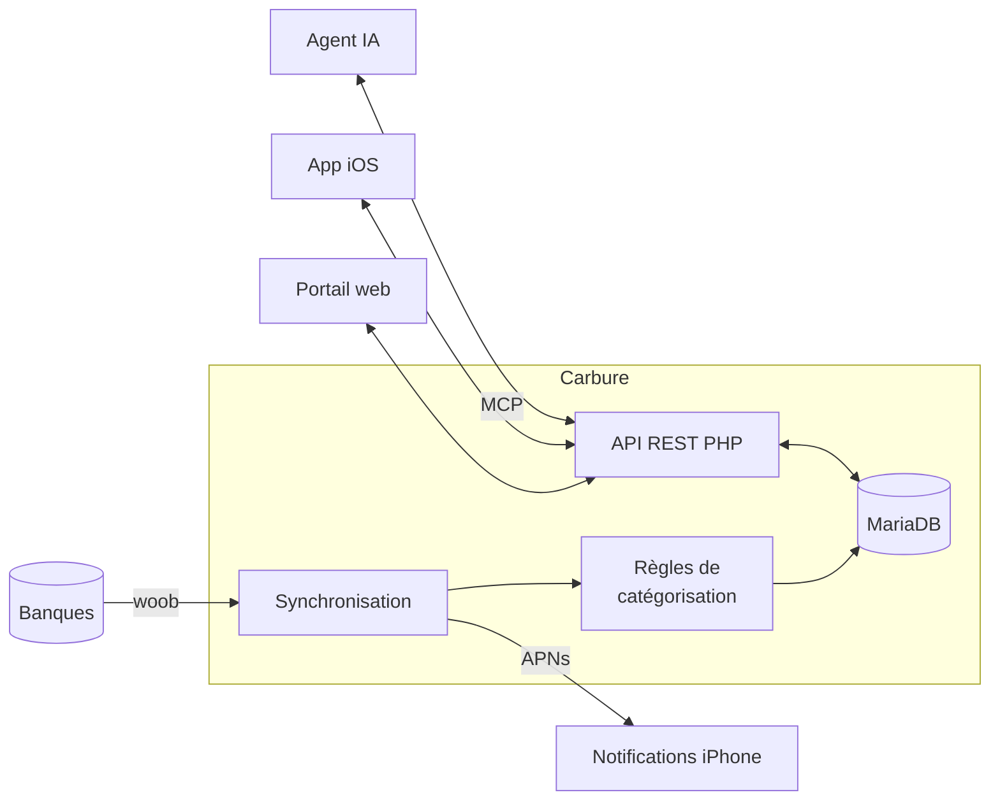

<p align="center">
  
</p>

<h1 align="center">Carbure</h1>

<p align="center">
  <a href="README.md">English</a> · <strong>Français</strong>
</p>

<p align="center">
  <strong>Le budget de votre foyer, enfin sous contrôle.</strong><br>
  Vos comptes bancaires synchronisés automatiquement, vos dépenses catégorisées,<br>
  vos budgets suivis au jour le jour — sur le web et sur iPhone. Hébergé chez vous, gratuit et open source.
</p>

<p align="center">
  <strong>💸 Gratuit, sans abonnement · 🏠 100 % hébergé chez vous · 🙅 Aucun service cloud tiers</strong>
</p>

<p align="center">
  <a href="https://github.com/ltoinel/Carbure/actions/workflows/ci.yml"></a>
  <a href="https://github.com/ltoinel/Carbure/actions/workflows/security.yml"></a>
  <a href="https://github.com/ltoinel/Carbure/releases"></a>
  <a href="https://hub.docker.com/r/ltoinel/carbure"></a>
  <a href="https://github.com/ltoinel/Carbure/actions/workflows/ci.yml"></a>
  <a href="https://www.php.net/"></a>
  <a href="https://mariadb.org/"></a>
  <a href="https://ltoinel.github.io/Carbure/"></a>
  <a href="LICENSE"></a>
</p>

<p align="center">
  <a href="https://ltoinel.github.io/Carbure/carbure-teaser.mp4"></a>
</p>

<p align="center">
  
</p>

<table>
  <tr>
    <td width="50%" valign="top">
      
      <br><sub><b>Budgets</b> — dépensé, restant et dépassement par catégorie</sub>
    </td>
    <td width="50%" valign="top">
      
      <br><sub><b>Flux du mois</b> — où partent les revenus du mois</sub>
    </td>
  </tr>
</table>

<p align="center">👉 <a href="https://ltoinel.github.io/Carbure/fonctionnalites/"><b>Toutes les fonctionnalités</b></a>, avec chaque écran</p>

## Pourquoi Carbure ?

- 🔄 **Zéro saisie** : vos opérations arrivent toutes seules depuis votre banque, chaque jour,
  grâce à [woob](https://woob.tech/) — une connexion directe, sans agrégateur tiers. Ou
  importez les relevés de votre banque (OFX, QIF, CSV, CAMT.053) : Carbure repère d'abord les
  doublons.
- 🏷️ **Catégorisation automatique** : des règles simples (« CARREFOUR → Supermarché ») classent
  chaque transaction. Une nouvelle ? Choisissez sa catégorie, Carbure vous propose la règle.
- 🎯 **Budgets mensuels** : dépensé, restant, dépassement, catégorie par catégorie, d'un coup
  d'œil. Budgétez les sous-catégories et leur parent les additionne — ou fixez-lui son propre
  montant. Le **flux du mois** montre d'où vient l'argent et où il part : un clic sur une
  catégorie affiche ses transactions.
- 📈 **Tendances** : revenus, dépenses et épargne sur 3, 6 ou 12 mois, comparés à la période
  précédente ou à la même période l'an dernier.
- ✅ **Pointage** : vérifiez vos transactions en un clic, filtrez celles qui restent à contrôler.
- 🔔 **Alertes sur iPhone** : un push après chaque synchronisation, dès qu'une dépense dépasse
  le seuil que vous avez choisi, ou quand une règle que vous avez désignée s'applique.
- 📊 **Insights** : vos propres indicateurs du mois (courses, carburant, abonnements…).
- 👨‍👩‍👧 **Pensé pour le foyer** : plusieurs utilisateurs, des comptes et des données partagés,
  chacun sa langue et ses appareils ; un administrateur gère comptes, catégories, règles,
  utilisateurs et configuration, et copie la commande toute prête qui planifie la synchro.
- 🤖 **Interrogez vos comptes avec votre agent IA** : un serveur MCP intégré, en lecture seule
  et désactivable, répond à « combien en restaurants cette année ? » ou « où dépasse-t-on le
  budget ? ». Claude (web, Desktop, mobile) se connecte avec la seule URL du serveur, après
  votre accord dans le portail ; Claude Code, ChatGPT, Cursor, Copilot et Gemini avec un
  jeton d'accès.
- 🔒 **Tout reste chez vous** : Carbure tourne sur votre propre serveur (un NAS suffit). Pas de
  compte à créer, pas d'agrégateur, pas de cloud : vos identifiants et vos données bancaires
  restent dans votre base locale. Seules sorties réseau : votre banque (woob) et, si vous
  l'activez, le service de notifications d'Apple.

> 🌍 **Banques couvertes** : Carbure s'appuie sur les modules [woob](https://woob.tech/), qui
> couvrent surtout les banques françaises. Le portail existe en français et en anglais ; les
> montants sont en euros.

> 📱 **App iPhone** : l'application iOS Carbure sera prochainement disponible sur l'App Store.

## Comment se situe Carbure ?

| | **Carbure** | **Firefly III** | **Actual Budget** | **Kresus** |
|---|---|---|---|---|
| Connexion bancaire | Directe, via woob | Agrégateurs tiers | Agrégateurs tiers | Directe, via woob |
| Sous-catégories additionnées dans leur parent | ✅ | ➖ | ⚠️ | ➖ |
| Plusieurs utilisateurs sur les mêmes données | ✅ | ⚠️ | ✅ | ➖ |
| App iPhone native et notifications push | ✅ | ➖ | ➖ | ➖ |
| Serveur MCP intégré pour les agents IA | ✅ | ➖ | ➖ | ➖ |
| Import de fichiers (OFX, QIF, CSV, CAMT.053) | ✅ | ✅ | ✅ | ⚠️ |
| Plusieurs devises | ➖ | ✅ | ➖ | ⚠️ |

✅ oui · ⚠️ en partie · ➖ non — 👉 **[Comparatif complet](https://ltoinel.github.io/Carbure/comparatif/)** :
23 critères (hébergement, données bancaires, budget, foyer et appareils, API), avec les points
forts de chacun.

## Comment ça marche



## Démarrage rapide

Avec Docker (nginx, PHP et woob inclus) :

```bash
git clone https://github.com/ltoinel/Carbure.git && cd Carbure/docker
docker compose up -d
```

Ouvrez `http://localhost:8080/` : **l'assistant d'installation** s'occupe de tout (base de
données, compte administrateur, et en option des catégories, règles et insights de
départ) en trois clics, sans aucune commande. Les mises à jour de la
base de données sont, elles aussi, automatiques. Sur un NAS Synology, suivez le
[tutoriel](https://ltoinel.github.io/Carbure/synology/).

👉 **Installation détaillée, configuration, référence de l'API, modèle de données et sécurité :
[la documentation](https://ltoinel.github.io/Carbure/).**

## Contribuer

Les contributions sont les bienvenues : lisez [AGENTS.md](AGENTS.md) (conventions, tests,
définition de « terminé ») et la liste des tâches ouvertes dans [TODO.md](TODO.md). Un bug, une
idée ? [Ouvrez une issue](https://github.com/ltoinel/Carbure/issues). Si Carbure vous est utile,
une ⭐ aide d'autres personnes à le découvrir.

Pour développer, `./start.sh` démarre l'environnement de développement avec Docker : l'image
de production et MariaDB, le code du dépôt monté en direct et un foyer d'exemple
(`http://localhost:8000/portal/`, `admin` / `admin-password`). Les tests (PHPUnit, tests
unitaires du portail, tests de bout en bout Playwright) sont décrits dans la
[documentation développeur](https://ltoinel.github.io/Carbure/developpement/).

## Licence

[MIT](LICENSE) © Ludovic Toinel

### Composants tiers

L'image Docker embarque des logiciels tiers, non modifiés, sous leur propre licence :

| Composant | Licence | Source |
|---|---|---|
| [woob](https://woob.tech) (synchronisation bancaire) | LGPL-3.0-or-later | [gitlab.com/woob/woob](https://gitlab.com/woob/woob) (version fixée par `WOOB_VERSION` dans `docker/Dockerfile`) |
| [curl_cffi](https://github.com/lexiforest/curl_cffi) | MIT | [github.com/lexiforest/curl_cffi](https://github.com/lexiforest/curl_cffi) |
| PHP, nginx, Alpine Linux | Licence PHP, BSD-2-Clause, diverses (BusyBox : GPL-2.0) | Images officielles `php:8.3-fpm-alpine` |
| Vue.js, CodeMirror, Roboto, Material Icons (portail) | MIT, MIT, OFL-1.1, Apache-2.0 | [`portal/vendor/`](portal/vendor/README.md) |

Carbure appelle woob comme un programme séparé ; il peut être remplacé par une autre
version de woob (environnement virtuel `/opt/woob`).

La musique du [teaser](https://ltoinel.github.io/Carbure/carbure-teaser.mp4) est
« Nowhere Land » de Kevin MacLeod ([incompetech.com](https://incompetech.com)), sous
licence [Creative Commons : Attribution 4.0](https://creativecommons.org/licenses/by/4.0/deed.fr).
