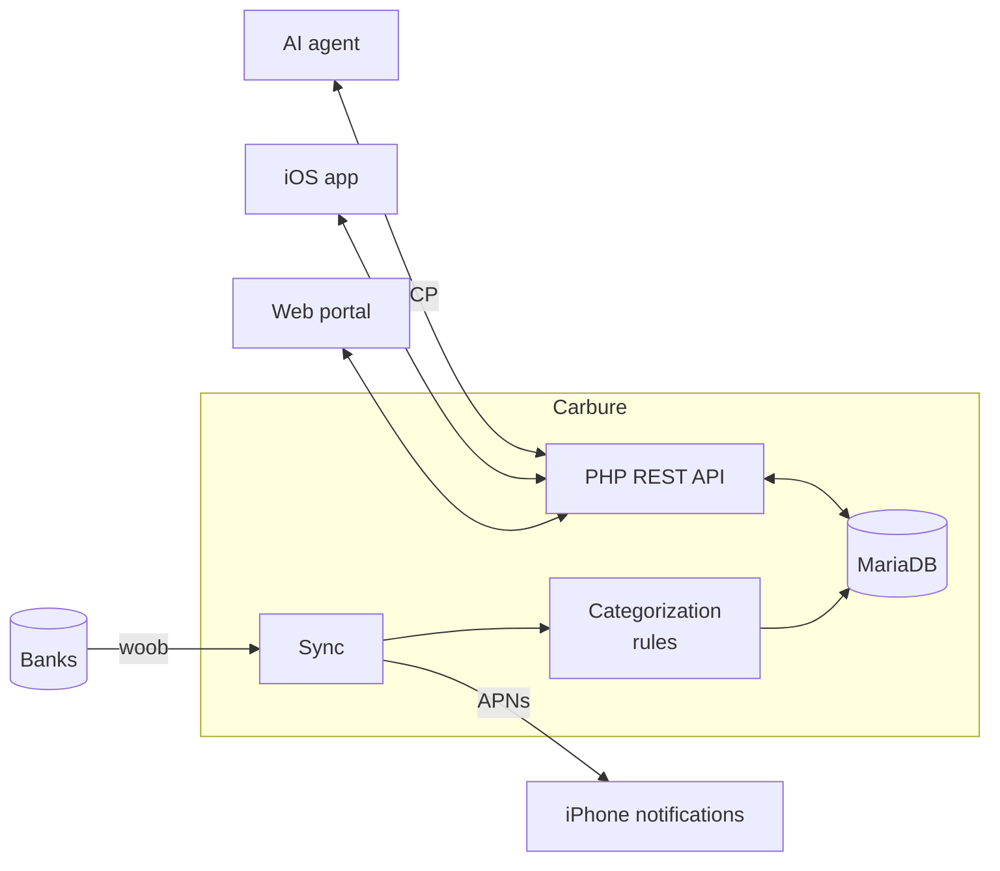

<p align="center">
  
</p>

<h1 align="center">Carbure</h1>

<p align="center">
  <strong>English</strong> · <a href="README.fr.md">Français</a>
</p>

<p align="center">
  <strong>Your household budget, finally under control.</strong><br>
  Bank accounts synced automatically, expenses categorized, budgets tracked day by day —<br>
  on the web and on iPhone. Self-hosted, free and open source.
</p>

<p align="center">
  <strong>💸 Free, no subscription · 🏠 100% self-hosted · 🙅 No third-party cloud</strong>
</p>

<p align="center">
  <a href="https://github.com/ltoinel/Carbure/actions/workflows/ci.yml"></a>
  <a href="https://github.com/ltoinel/Carbure/releases"></a>
  <a href="https://hub.docker.com/r/ltoinel/carbure"></a>
  <a href="https://github.com/ltoinel/Carbure/actions/workflows/ci.yml"></a>
  <a href="https://www.php.net/"></a>
  <a href="https://mariadb.org/"></a>
  <a href="https://ltoinel.github.io/Carbure/"></a>
  <a href="LICENSE"></a>
</p>

<p align="center">
  
</p>

<p align="center">
  
  
</p>

## Why Carbure?

- 🔄 **No manual entry**: transactions arrive on their own from your bank every day, through
  [woob](https://woob.tech/) — a direct connection, no third-party aggregator.
- 🏷️ **Automatic categorization**: simple rules ("CARREFOUR → Groceries") sort every
  transaction. A new one? Pick its category and Carbure suggests the rule.
- 🎯 **Monthly budgets**: spent, remaining and overspent, category by category, at a glance —
  plus the **monthly flow**: where the money comes from and where it goes (spending, savings,
  remainder).
- 📈 **Trends**: income, spending and savings over 3, 6 or 12 months, compared with the
  previous period or the same period last year.
- ✅ **Check-off**: verify transactions in one click and filter those still to review.
- 🔔 **iPhone alerts**: a push after each sync, and as soon as an expense exceeds the threshold
  you set.
- 📊 **Insights**: your own monthly indicators (groceries, fuel, subscriptions…).
- 👨‍👩‍👧 **Built for households**: several users, shared accounts and data, each with their own
  language and devices; an administrator manages accounts, categories, rules and users.
- 🤖 **Ask your AI agent about your money** (Claude, ChatGPT, Cursor, Copilot, Gemini): a
  built-in, read-only MCP server — which you can turn off — answers questions like "how much
  did we spend on restaurants this year?" or "which budgets are we over?".
- 🔒 **Everything stays with you**: Carbure runs on your own server (a NAS is enough). No
  account to create, no aggregator, no cloud: your bank credentials and data stay in your
  local database. The only outbound connections are to your bank (woob) and, if you enable
  them, Apple's push notification service.

> 🌍 **Bank coverage**: Carbure relies on [woob](https://woob.tech/) modules, which mainly
> cover French banks. The portal is available in English and French.

## How does it compare?

| | Carbure | Firefly III | Actual Budget | Kresus |
|---|---|---|---|---|
| Self-hosted, open source | ✅ | ✅ | ✅ | ✅ |
| Bank connection | Direct, via woob | Importer + third-party providers | Third-party providers | Direct, via woob |
| Native iPhone app with push alerts | ✅ | Third-party apps | ➖ | ➖ |
| Built-in MCP server for AI agents | ✅ | ➖ | ➖ | ➖ |

<sub>To the best of our knowledge as of October 2026 — corrections welcome via an issue.</sub>

## How it works



## Quick start

With Docker (nginx, PHP and woob included):

```bash
git clone https://github.com/ltoinel/Carbure.git && cd Carbure/docker
docker compose up -d
```

Open `http://localhost:8080/`: **the setup wizard** handles everything (database,
administrator account) in three clicks, with no command to run. Database upgrades are
automatic too. On a Synology NAS, follow the
[tutorial](https://ltoinel.github.io/Carbure/synology/).

👉 **Detailed installation, configuration, API reference, data model and security:
[the documentation](https://ltoinel.github.io/Carbure/)** (in French).

## Contributing

Contributions are welcome: read [AGENTS.md](AGENTS.md) (conventions, tests, definition of
done) and the open tasks in [TODO.md](TODO.md). Found a bug or have an idea?
[Open an issue](https://github.com/ltoinel/Carbure/issues). If Carbure is useful to you,
a ⭐ helps others find it.

## License

[MIT](LICENSE) © Ludovic Toinel
