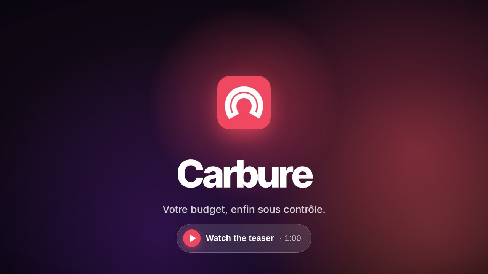
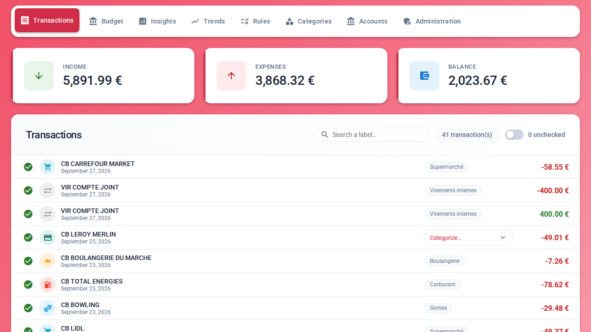
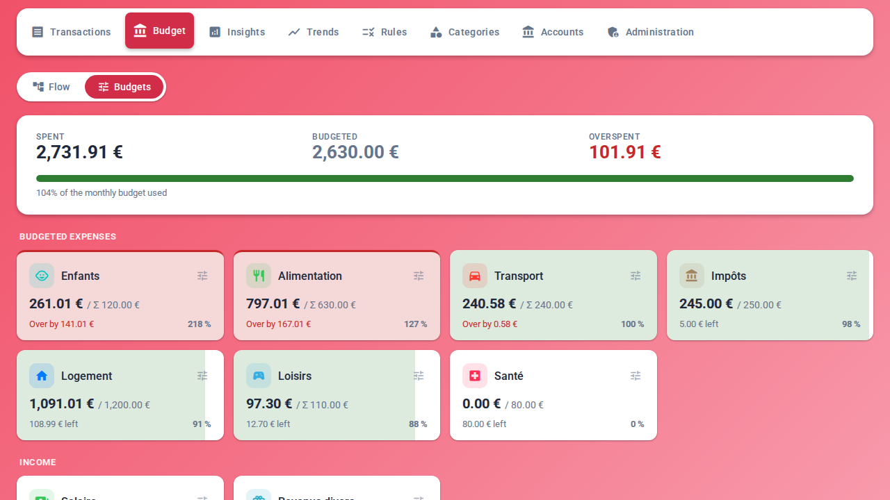
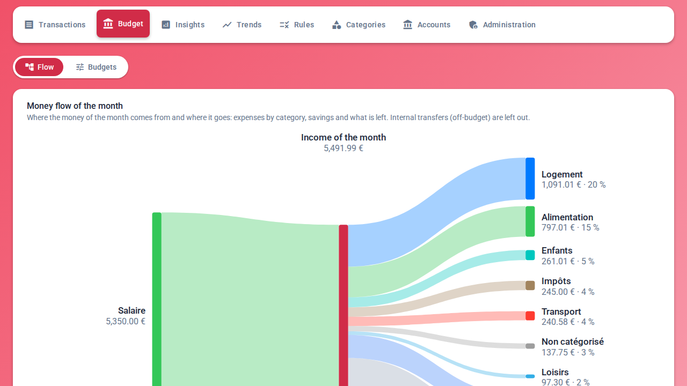
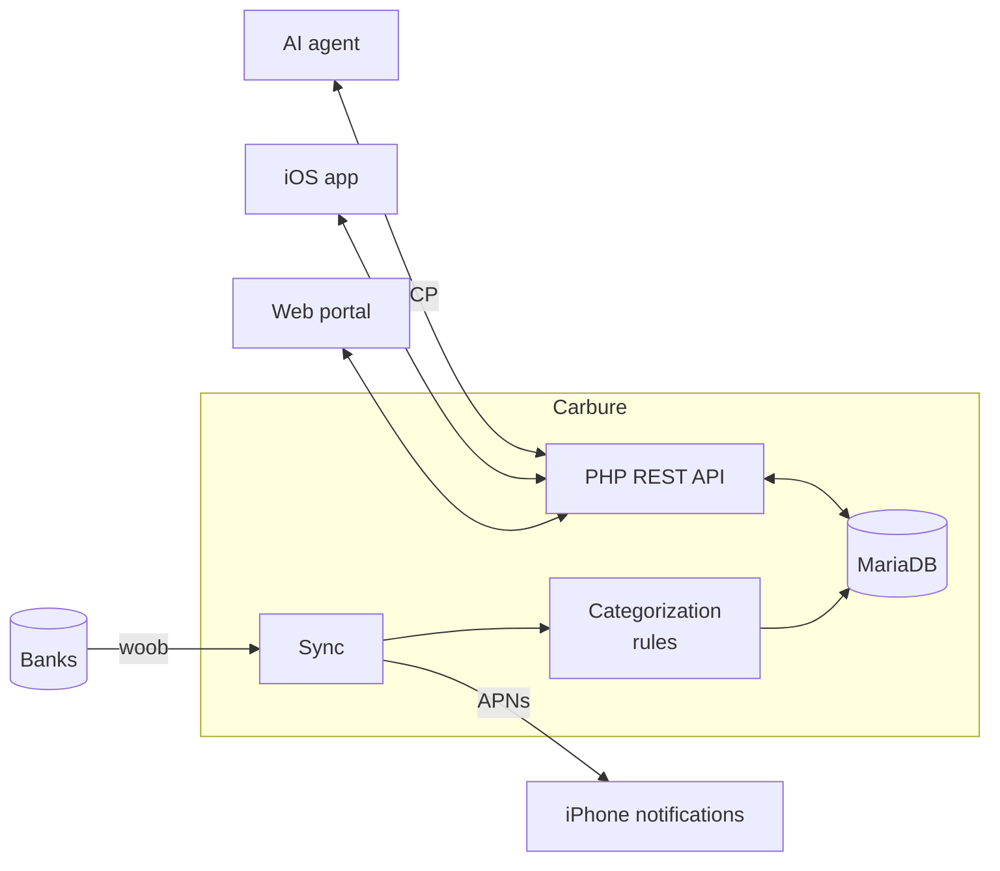

<p align="center">
  
</p>

<h1 align="center">Carbure</h1>

<p align="center">
  <strong>English</strong> · <a href="README.fr.md">Français</a>
</p>

<p align="center">
  <strong>Your household budget, finally under control.</strong><br>
  Bank accounts synced automatically, expenses categorized, budgets tracked day by day —<br>
  on the web and on iPhone. Self-hosted, free and open source.
</p>

<p align="center">
  <strong>💸 Free, no subscription · 🏠 100% self-hosted · 🙅 No third-party cloud</strong>
</p>

<p align="center">
  <a href="https://github.com/ltoinel/Carbure/actions/workflows/ci.yml"></a>
  <a href="https://github.com/ltoinel/Carbure/actions/workflows/security.yml"></a>
  <a href="https://github.com/ltoinel/Carbure/releases"></a>
  <a href="https://hub.docker.com/r/ltoinel/carbure"></a>
  <a href="https://github.com/ltoinel/Carbure/actions/workflows/ci.yml"></a>
  <a href="https://www.php.net/"></a>
  <a href="https://mariadb.org/"></a>
  <a href="https://ltoinel.github.io/Carbure/"></a>
  <a href="LICENSE"></a>
</p>

<p align="center">
  <a href="https://ltoinel.github.io/Carbure/carbure-teaser.mp4"></a>
</p>

<p align="center">
  
</p>

<table>
  <tr>
    <td width="50%" valign="top">
      
      <br><sub><b>Budgets</b> — spent, remaining and overspent per category</sub>
    </td>
    <td width="50%" valign="top">
      
      <br><sub><b>Money flow</b> — where the month's income goes</sub>
    </td>
  </tr>
</table>

<p align="center">👉 <a href="https://ltoinel.github.io/Carbure/fonctionnalites/"><b>All the features</b></a>, with every screen (in French)</p>

## Why Carbure?

- 🔄 **No manual entry**: transactions arrive on their own from your bank every day, through
  [woob](https://woob.tech/) — a direct connection, no third-party aggregator. Or import the
  statements of your bank (OFX, QIF, CSV, CAMT.053): Carbure spots the duplicates first.
- 🏷️ **Automatic categorization**: simple rules ("CARREFOUR → Groceries") sort every
  transaction. A new one? Pick its category and Carbure suggests the rule.
- 🎯 **Monthly budgets**: spent, remaining and overspent, category by category, at a glance.
  Budget the sub-categories and their parent adds them up — or set its own amount. The
  **monthly flow** shows where the money comes from and where it goes: click a category to
  see its transactions.
- 📈 **Trends**: income, spending and savings over 3, 6 or 12 months, compared with the
  previous period or the same period last year.
- ✅ **Check-off**: verify transactions in one click and filter those still to review.
- 🔔 **iPhone alerts**: a push after each sync, as soon as an expense exceeds the threshold
  you set, or when a rule you chose matches.
- 📊 **Insights**: your own monthly indicators (groceries, fuel, subscriptions…).
- 👨‍👩‍👧 **Built for households**: several users, shared accounts and data, each with their own
  language and devices; an administrator manages accounts, categories, rules, users and the
  configuration, and copies the ready-made command that schedules the sync.
- 🤖 **Ask your AI agent about your money**: a built-in, read-only MCP server — which you can
  turn off — answers questions like "how much did we spend on restaurants this year?" or
  "which budgets are we over?". Claude (web, Desktop, mobile) connects from the server URL
  alone, after your approval in the portal; Claude Code, ChatGPT, Cursor, Copilot and Gemini
  with an access token.
- 🔒 **Everything stays with you**: Carbure runs on your own server (a NAS is enough). No
  account to create, no aggregator, no cloud: your bank credentials and data stay in your
  local database. The only outbound connections are to your bank (woob) and, if you enable
  them, Apple's push notification service.

> 🌍 **Bank coverage**: Carbure relies on [woob](https://woob.tech/) modules, which mainly
> cover French banks. The portal is available in English and French; amounts are in euros.

> 📱 **iPhone app**: the Carbure iOS app will soon be available on the App Store.

## How does it compare?

| | **Carbure** | **Firefly III** | **Actual Budget** | **Kresus** |
|---|---|---|---|---|
| Bank connection | Direct, via woob | Third-party aggregators | Third-party aggregators | Direct, via woob |
| Sub-categories adding up to their parent | ✅ | ➖ | ⚠️ | ➖ |
| Several users sharing the same data | ✅ | ⚠️ | ✅ | ➖ |
| Native iPhone app and push notifications | ✅ | ➖ | ➖ | ➖ |
| Built-in MCP server for AI agents | ✅ | ➖ | ➖ | ➖ |
| File import (OFX, QIF, CSV, CAMT.053) | ✅ | ✅ | ✅ | ⚠️ |
| Several currencies | ➖ | ✅ | ➖ | ⚠️ |

✅ yes · ⚠️ partly · ➖ no — 👉 **[Full comparison](https://ltoinel.github.io/Carbure/comparatif/)** (in French):
23 criteria (hosting, bank data, budget, household and devices, API), with the strengths of
each tool.

## How it works



## Quick start

With Docker (nginx, PHP and woob included):

```bash
git clone https://github.com/ltoinel/Carbure.git && cd Carbure/docker
docker compose up -d
```

Open `http://localhost:8080/`: **the setup wizard** handles everything (database,
administrator account, and optional starter categories, rules and insights) in three
clicks, with no command to run. Database upgrades are
automatic too. On a Synology NAS, follow the
[tutorial](https://ltoinel.github.io/Carbure/synology/).

👉 **Detailed installation, configuration, API reference, data model and security:
[the documentation](https://ltoinel.github.io/Carbure/)** (in French).

## Contributing

Contributions are welcome: read [AGENTS.md](AGENTS.md) (conventions, tests, definition of
done) and the open tasks in [TODO.md](TODO.md). Found a bug or have an idea?
[Open an issue](https://github.com/ltoinel/Carbure/issues). If Carbure is useful to you,
a ⭐ helps others find it.

To develop, `./start.sh` starts the development environment with Docker: the production
image and MariaDB, the code of the repository mounted live and a sample household
(`http://localhost:8000/portal/`, `admin` / `admin-password`). The tests (PHPUnit, portal
unit tests, Playwright end-to-end tests) are described in the
[developer documentation](https://ltoinel.github.io/Carbure/developpement/) (in French).

## License

[MIT](LICENSE) © Ludovic Toinel

### Third-party components

The Docker image bundles third-party software, unmodified, under its own license:

| Component | License | Source |
|---|---|---|
| [woob](https://woob.tech) (bank synchronization) | LGPL-3.0-or-later | [gitlab.com/woob/woob](https://gitlab.com/woob/woob) (version set by `WOOB_VERSION` in `docker/Dockerfile`) |
| [curl_cffi](https://github.com/lexiforest/curl_cffi) | MIT | [github.com/lexiforest/curl_cffi](https://github.com/lexiforest/curl_cffi) |
| PHP, nginx, Alpine Linux | PHP License, BSD-2-Clause, various (BusyBox: GPL-2.0) | Official images `php:8.3-fpm-alpine` |
| Vue.js, CodeMirror, Roboto, Material Icons (portal) | MIT, MIT, OFL-1.1, Apache-2.0 | [`portal/vendor/`](portal/vendor/README.md) |

Carbure calls woob as a separate program; it can be replaced by another woob version
(virtual environment `/opt/woob`).

The music of the [teaser](https://ltoinel.github.io/Carbure/carbure-teaser.mp4) is
"Nowhere Land" by Kevin MacLeod ([incompetech.com](https://incompetech.com)), licensed
under [Creative Commons: By Attribution 4.0](https://creativecommons.org/licenses/by/4.0/).
