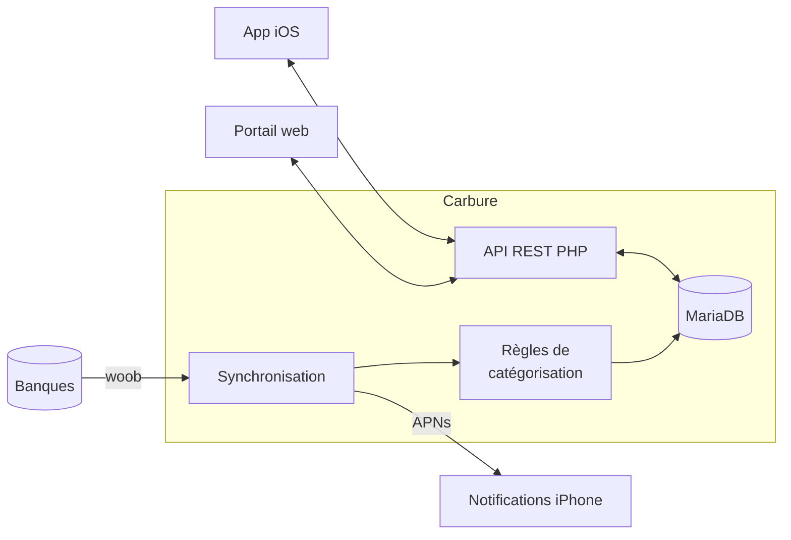

<p align="center">
  
</p>

<h1 align="center">Carbure</h1>

<p align="center">
  <strong>Le budget de votre foyer, enfin sous contrôle.</strong><br>
  Vos comptes bancaires synchronisés automatiquement, vos dépenses catégorisées,<br>
  vos budgets suivis au jour le jour — sur le web et sur iPhone.
</p>

<p align="center">
  <strong>💸 Gratuit, sans abonnement · 🏠 100 % hébergé chez vous · 🙅 Aucun service cloud tiers</strong>
</p>

<p align="center">
  <a href="https://github.com/ltoinel/Carbure/actions/workflows/ci.yml"></a>
  <a href="https://github.com/ltoinel/Carbure/releases"></a>
  <a href="https://github.com/ltoinel/Carbure/actions/workflows/ci.yml"></a>
  <a href="https://www.php.net/"></a>
  <a href="https://mariadb.org/"></a>
  <a href="https://ltoinel.github.io/Carbure/"></a>
  <a href="LICENSE"></a>
</p>

<p align="center">
  
</p>

## Pourquoi Carbure ?

- 🔄 **Zéro saisie** : vos opérations arrivent toutes seules depuis votre banque grâce à
  [woob](https://woob.tech/), chaque jour.
- 🏷️ **Catégorisation automatique** : des règles simples (« CARREFOUR → Supermarché ») classent
  chaque transaction. Une nouvelle ? Choisissez sa catégorie, Carbure vous propose la règle.
- 🎯 **Budgets mensuels** : dépensé, restant, dépassement, catégorie par catégorie, d'un coup d'œil.
- 📈 **Tendances** : revenus, dépenses, épargne sur 3, 6 ou 12 mois, comparés à la période
  précédente ou à l'an dernier.
- ✅ **Pointage** : vérifiez vos transactions en un clic, filtrez celles qui restent à contrôler.
- 🔔 **Alertes sur iPhone** : un push après chaque synchronisation, et dès qu'une dépense dépasse
  le seuil que vous avez choisi.
- 👨‍👩‍👧 **Pensé pour le foyer** : plusieurs utilisateurs, des données partagées, chacun sa langue
  et ses appareils.
- 🔒 **Tout reste chez vous, sans abonnement** : Carbure est gratuit et open source, il tourne
  sur votre propre serveur (un NAS suffit). Pas de compte à créer, pas d'agrégateur bancaire tiers,
  pas de cloud : vos identifiants et vos données bancaires restent dans votre base locale.
  Seules sorties réseau : la connexion directe à votre banque (woob) et, si vous l'activez,
  l'envoi des notifications via Apple.

## Comment ça marche



## Démarrage rapide

```bash
git clone https://github.com/ltoinel/Carbure.git
cd Carbure
cp conf/prod.sample.ini conf/prod.ini        # base de données, jwtsecret, woob, APNs
mysql carbure < sql/carbure.sql              # schéma
```

Servez le dossier avec PHP ≥ 8.2 (Nginx/Apache + PHP-FPM), routez `/api/*` vers `src/api.php`,
puis ouvrez `/portal/`. Planifiez `/api/bank/sync` (avec votre `sync_token`) pour la synchronisation
quotidienne.

👉 **Installation détaillée, configuration, référence de l'API, modèle de données et sécurité :
[la documentation](https://ltoinel.github.io/Carbure/).**

## Contribuer

Les contributions sont les bienvenues : lisez [AGENTS.md](AGENTS.md) (conventions, tests,
définition de « terminé ») et la liste des tâches ouvertes dans [TODO.md](TODO.md).

## Licence

[MIT](LICENSE) © Ludovic Toinel
