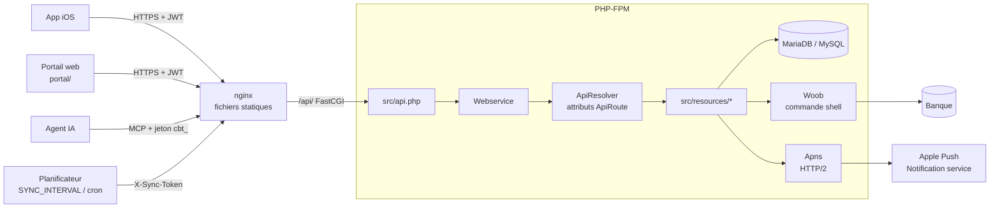
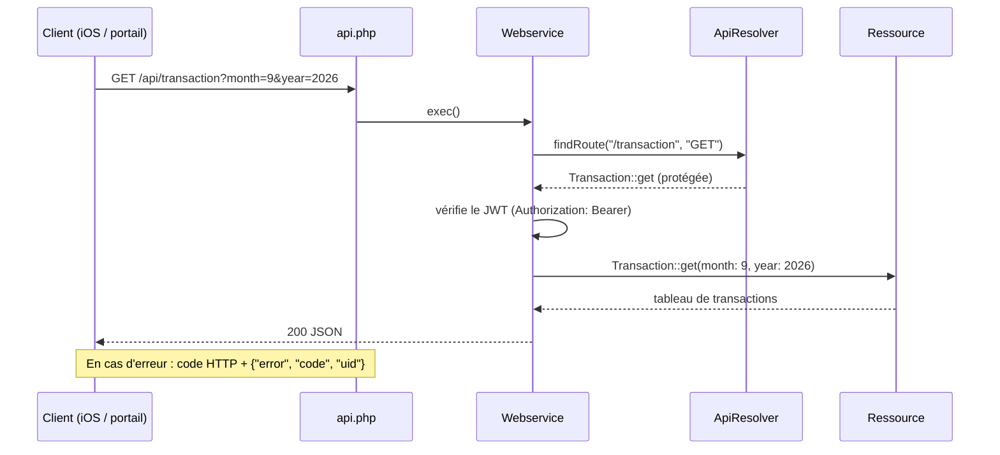
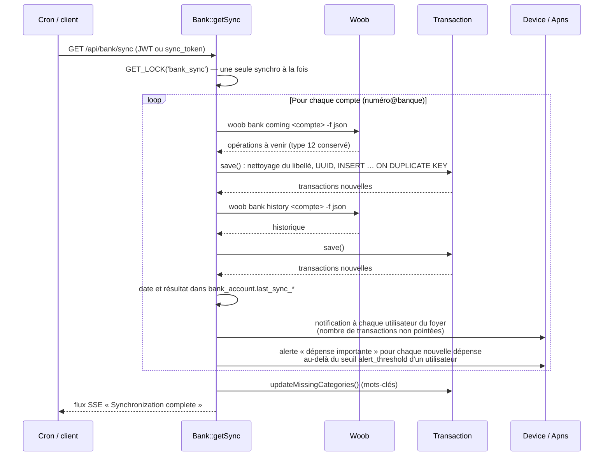
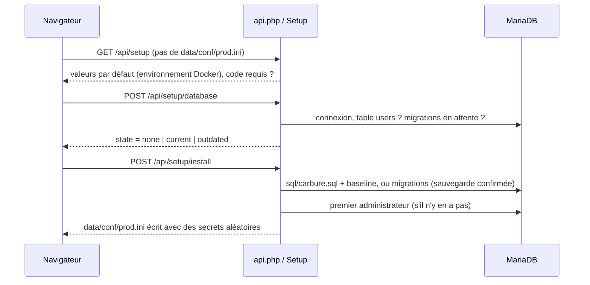

# Architecture

## Vue d'ensemble

| Couche | Rôle |
|---|---|
| nginx | Sert le portail (`/portal/`) et Swagger UI (`/swagger/`) avec leurs en-têtes de sécurité, transmet `/api/` à PHP-FPM (sans tampon, pour les flux SSE) ; tout autre chemin renvoie `404` |
| `src/api.php` | Point d'entrée : sans configuration, ne sert que l'assistant d'installation (`Setup`) ; sinon toute URL sans point est traitée comme un appel d'API ; convertit les erreurs en réponse JSON avec code HTTP |
| `Webservice` | Lit le corps JSON et la query string, positionne les en-têtes (sécurité, JSON ou SSE), contrôle l'accès (JWT), appelle la ressource |
| `ApiResolver` | Découvre les routes par réflexion sur l'attribut `#[ApiRoute(path, method, public, stream, raw)]`, avec cache APCu invalidé quand un fichier de ressource change |
| `src/resources/` | Logique métier : `User`, `Bank`, `Transaction`, `Budget`, `Category`, `Insight`, `Device`, `ApiToken`, `Mcp`, `System` |
| `Setup`, `Installer` | Assistant d'installation (`/api/setup`) : base, schéma, premier administrateur, `data/conf/prod.ini` |
| `Migrator` | Versionnement du schéma (table `schema_migrations`) et application des migrations |
| `Setting` | Réglages modifiés depuis le portail (table `settings`) |
| `Db` | Connexion `mysqli` unique, requêtes préparées |
| `Woob` | Exécution de woob (`proc_open`) avec envoi de *heartbeats* SSE pendant l'attente |
| `Apns` | Envoi des notifications (authentification par clé `.p8` ou certificat) |
| `Logger` | Logs bufferisés dans `data/logs/carbure_AAAAMMJJ.log`, une entrée JSON par ligne : heure ISO 8601, niveau, identifiant de requête (`uid`), IP du client, utilisateur, méthode et chemin, message et contexte ; une ligne de fin par requête (statut, durée) ; purge après `log_retention_days` jours |

## Traitement d'une requête

Les paramètres sont passés **par nom** : la clé `month` de la requête alimente le
paramètre `$month` de la méthode. Un paramètre inconnu provoque une erreur 400.

## Synchronisation bancaire

- `?account=<numéro>@<banque>` limite la synchronisation à un compte (bouton de
  synchronisation de l'onglet Comptes).
- Les transactions importées sont rattachées au premier utilisateur ayant ajouté le compte
  (`MIN(user_id)` dans `bank_account`), sans restreindre leur visibilité.
- Le **libellé** est mis en majuscules puis nettoyé par les expressions régulières
  `regex_label` de la configuration.
- L'**UUID** d'une transaction est `md5(date réelle + libellé + montant)` (libellé tronqué
  à 24 caractères pour les paiements par carte) : il permet de dédoublonner les
  transactions entre deux synchronisations et de transformer une opération « en cours »
  en opération débitée.
- Les virements de type 1 (salaire) datés après le 25 sont rattachés au mois suivant.
- La **catégorisation** recherche les mots-clés de `bank_transaction_category_keyword`
  dans le libellé des transactions sans catégorie du dernier mois (ou de tout
  l'historique avec `POST /category/keyword/apply`).
- Une transaction est **nouvelle** quand son UUID n'existait pas (l'`INSERT` crée une
  ligne). Seules les nouvelles dépenses déclenchent l'alerte de seuil : une
  resynchronisation ou le passage d'une opération « en cours » à « débitée » ne
  ré-alerte pas.

## Portail web

Le portail (`portal/`) est une application Vue 3 sans étape de build : `index.html`
charge Vue, `i18n.js` et le module `app.js`. L'état et les méthodes sont répartis en
*mixins* (`portal/modules/`), les appels HTTP sont centralisés dans
`portal/services/apiService.js`. Voir [Portail web](portail.md).

## Installation et mises à jour du schéma

- Le schéma est **versionné** : `Migrator` liste les fichiers `sql/migrations/*.sql`, la
  table `schema_migrations` (créée au besoin) enregistre ceux appliqués, et la version du
  schéma est le dernier. Une installation neuve crée le schéma depuis `sql/carbure.sql` et
  enregistre toutes les migrations comme appliquées (*baseline*).
- Une migration peut déclarer `-- applied-if: <requête>` : si la requête renvoie un nombre
  non nul (migration déjà appliquée à la main), elle est seulement enregistrée.
- Les migrations en attente sont appliquées au démarrage du conteneur Docker
  (`tools/migrate.php`, le conteneur s'arrête si l'une échoue), dans l'assistant pour une
  base existante, ou par un administrateur depuis le bandeau du portail
  (`POST /api/system/migrate`).

## Serveur MCP

`POST /api/mcp` (`Mcp::handle`) est une route publique au sens du routeur, déclarée
`raw` : la méthode renvoie elle-même le corps JSON-RPC. Elle vérifie que le serveur est
activé (`Setting` `mcp_enabled`), l'en-tête `Origin`, puis authentifie le jeton d'accès
(`ApiToken::authenticate`, empreinte SHA-256, expiration) ou un JWT, et exécute les outils
en lecture seule en réutilisant les ressources (`Transaction`, `Budget`, `Category`) avec
l'identité de l'utilisateur du jeton. Voir [Agents IA (MCP)](mcp.md).

## Image Docker

| Élément | Rôle |
|---|---|
| `docker/Dockerfile` | `php:8.3-fpm-alpine` + nginx (image multi-étapes : woob est construit à part, sans compilateur dans l'image finale), extensions `mysqli` et APCu, woob et `curl_cffi` dans `/opt/woob`, `HEALTHCHECK` sur `/api/health` |
| `docker/nginx.conf` | Site nginx (portail, Swagger, API, en-têtes de sécurité) |
| `docker/php.ini`, `docker/php-fpm.conf` | Réglages PHP et PHP-FPM |
| `docker/entrypoint.sh` | Prépare `/data`, attend la base et applique les migrations si Carbure est installé, lance la synchronisation périodique (`SYNC_INTERVAL`), puis PHP-FPM et nginx |
| Volume `/data` (le dossier `data/` du projet) | `conf/prod.ini`, `conf/setup.code`, `conf/certs/`, `logs/`, `cache/`, configuration woob (`woob/`) |
