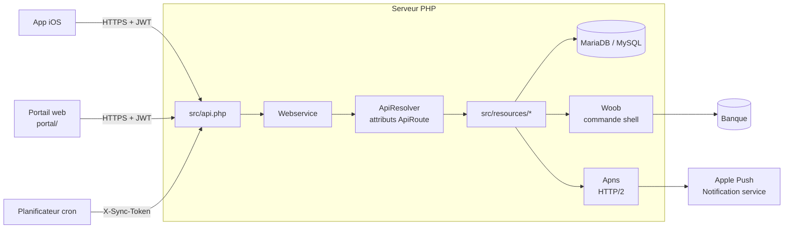
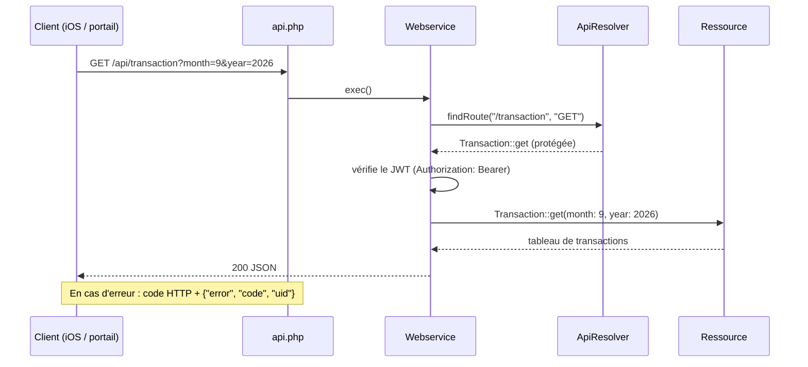
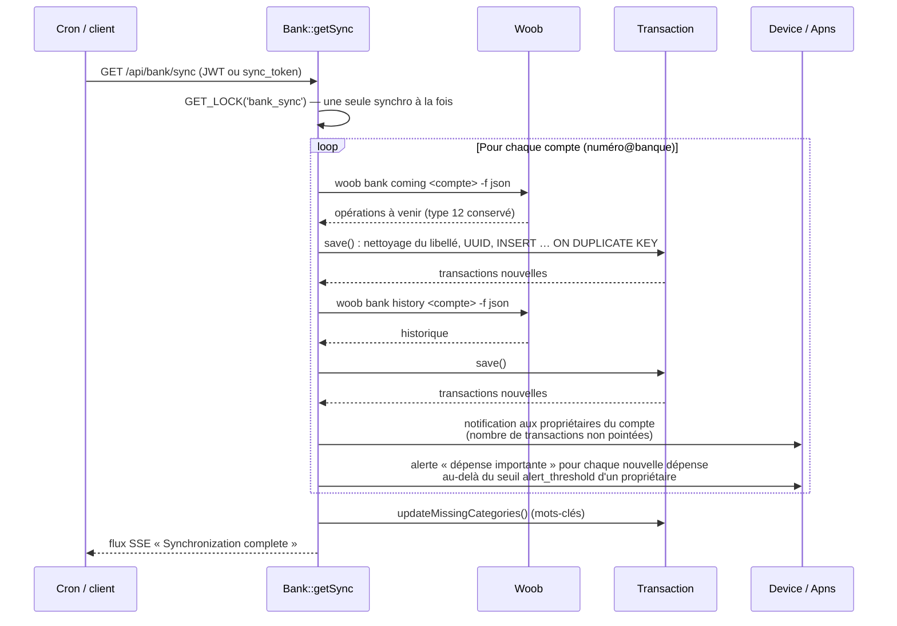

# Architecture

## Vue d'ensemble

| Couche | Rôle |
|---|---|
| `src/api.php` | Point d'entrée : toute URL sans point est traitée comme un appel d'API ; convertit les erreurs en réponse JSON avec code HTTP |
| `Webservice` | Lit le corps JSON et la query string, positionne les en-têtes (JSON ou SSE), contrôle l'accès (JWT), appelle la ressource |
| `ApiResolver` | Découvre les routes par réflexion sur l'attribut `#[ApiRoute]`, avec cache APCu invalidé quand un fichier de ressource change |
| `src/resources/` | Logique métier : `User`, `Bank`, `Transaction`, `Budget`, `Category`, `Device` |
| `Db` | Connexion `mysqli` unique, requêtes préparées |
| `Woob` | Exécution de woob (`proc_open`) avec envoi de *heartbeats* SSE pendant l'attente |
| `Apns` | Envoi des notifications (authentification par clé `.p8` ou certificat) |
| `Logger` | Logs bufferisés dans `logs/carbure_AAAAMMJJ.log`, avec un identifiant (`uid`) par requête |

## Traitement d'une requête

Les paramètres sont passés **par nom** : la clé `month` de la requête alimente le
paramètre `$month` de la méthode. Un paramètre inconnu provoque une erreur 400.

## Synchronisation bancaire

- Le **libellé** est mis en majuscules puis nettoyé par les expressions régulières
  `regex_label` de la configuration.
- L'**UUID** d'une transaction est `md5(date réelle + libellé + montant)` (libellé tronqué
  à 24 caractères pour les paiements par carte) : il permet de dédoublonner les
  transactions entre deux synchronisations et de transformer une opération « en cours »
  en opération débitée.
- Les virements de type 1 (salaire) datés après le 25 sont rattachés au mois suivant.
- La **catégorisation** recherche les mots-clés de `bank_transaction_category_keyword`
  dans le libellé des transactions sans catégorie du dernier mois (ou de tout
  l'historique avec `POST /category/keyword/apply`).
- Une transaction est **nouvelle** quand son UUID n'existait pas (l'`INSERT` crée une
  ligne). Seules les nouvelles dépenses déclenchent l'alerte de seuil : une
  resynchronisation ou le passage d'une opération « en cours » à « débitée » ne
  ré-alerte pas.

## Portail web

Le portail (`portal/`) est une application Vue 3 sans étape de build : `index.html`
charge Vue, `i18n.js` et le module `app.js`. L'état et les méthodes sont répartis en
*mixins* (`portal/modules/`), les appels HTTP sont centralisés dans
`portal/services/apiService.js`. Voir [Portail web](portail.md).
