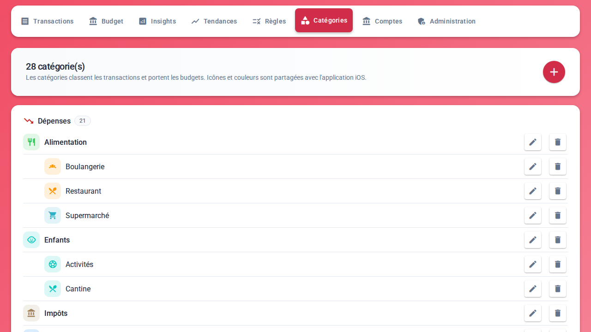
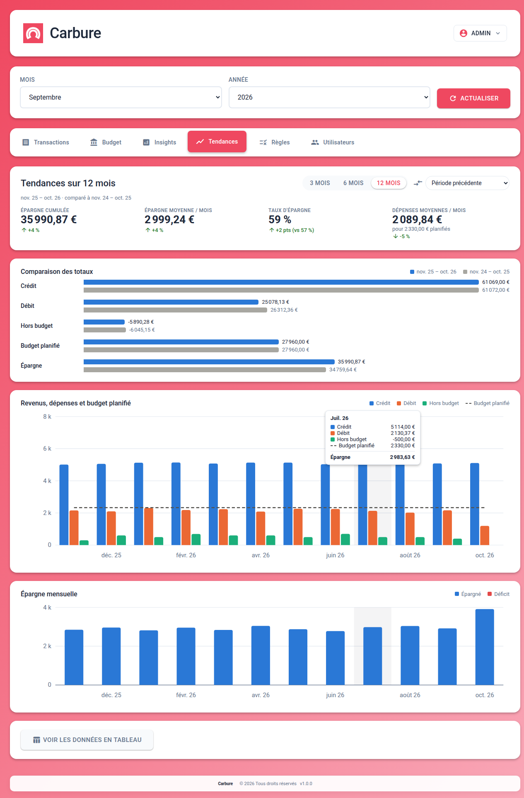
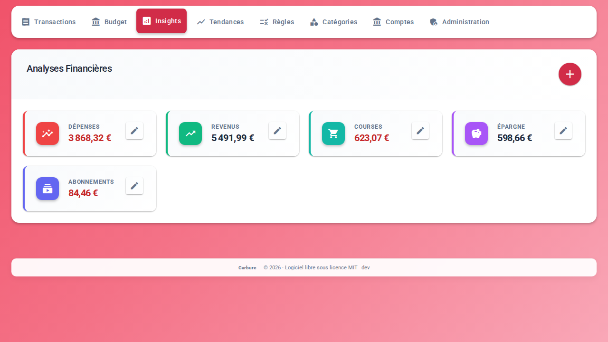
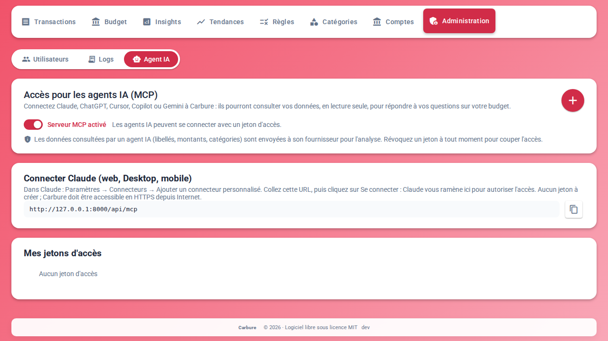

# Fonctionnalités

Cette page décrit **ce que fait Carbure** et **selon quelles règles** : d'où viennent les
transactions, comment elles sont classées, comment sont calculés les budgets, le flux du mois
et les tendances, qui reçoit quelle notification et ce que chacun peut faire. Pour
l'utilisation écran par écran, voir [Portail web](portail.md).

## Le foyer

Carbure gère **un foyer** : une installation, des comptes bancaires communs et des personnes
qui consultent les mêmes données.

- **Données partagées** : comptes bancaires, transactions, catégories, règles, budgets et
  insights sont communs à tous les utilisateurs. Une transaction appartient techniquement au
  premier utilisateur qui suit le compte, mais tous la voient et la pointent.
- **Données personnelles** : chaque utilisateur a son identifiant, son mot de passe, sa
  langue (français ou anglais), son seuil d'alerte, ses appareils iPhone et ses jetons d'accès
  pour les agents IA.
- **Deux profils** :

| | Utilisateur | Administrateur |
|---|---|---|
| Consulter transactions, budgets, flux, insights, tendances | ✅ | ✅ |
| Pointer et catégoriser les transactions | ✅ | ✅ |
| Modifier les montants des budgets | ✅ | ✅ |
| Gérer son profil, ses appareils, ses jetons d'accès | ✅ | ✅ |
| Créer et modifier les règles de catégorisation | ➖ | ✅ |
| Créer et modifier les catégories | ➖ | ✅ |
| Suivre des comptes bancaires, configurer les banques, synchroniser depuis le portail | ➖ | ✅ |
| Créer et modifier les insights (requêtes SQL) | ➖ | ✅ |
| Activer le serveur MCP pour les agents IA | ➖ | ✅ |
| Gérer les utilisateurs, consulter les logs, mettre à jour la base | ➖ | ✅ |

Le dernier administrateur ne peut pas perdre son rôle.

## Comptes bancaires et synchronisation

### Connexion aux banques

Carbure se connecte **directement** à chaque banque avec [woob](https://woob.tech/), un
logiciel libre qui interroge le site de la banque comme vous le feriez : pas d'agrégateur
bancaire tiers, pas de cloud. Les modules woob couvrent surtout les **banques françaises**.

- **Configurer une banque** : un administrateur choisit la banque parmi celles que woob
  supporte ; le portail affiche les champs que demande son module (numéro client, code
  secret, type de compte…). Ces identifiants sont confiés à woob, qui les garde dans son
  propre fichier, lisible par lui seul ; **Carbure ne les enregistre pas en base et ne les
  écrit pas dans les logs**.
- **Suivre un compte** : « Rechercher mes comptes dans woob » liste les comptes des banques
  configurées, avec leur libellé et leur solde ; un clic suit un compte. Un compte peut aussi
  être saisi à la main (identifiant et banque).
- Les **comptes suivis** sont communs au foyer : chacun indique qui l'a ajouté, la date et le
  résultat de sa dernière synchronisation (Synchronisé, Échec avec le message, ou Jamais
  synchronisé). Ne plus suivre un compte conserve ses transactions déjà importées.

### Déroulement d'une synchronisation

Pour chaque compte suivi :

1. **Opérations à venir**, puis **historique** : woob renvoie les dernières opérations
   (100 par défaut, réglage `woob_transactions`).
2. **Nettoyage du libellé** : passage en majuscules, suppression des préfixes et suffixes
   techniques de la banque (« FACTURE CARTE DU 040126 » devient « CB », numéro de carte retiré,
   références de mandat des prélèvements…), selon les expressions `regex_label` de la
   configuration.
3. **Dédoublonnage** : chaque opération reçoit une empreinte (date réelle, libellé nettoyé,
   montant) ; une opération déjà connue n'est jamais importée deux fois, même synchronisée
   plusieurs fois ou par deux utilisateurs.
4. **Mois de rattachement** : un **virement daté après le 25** est rattaché au **1er du mois
   suivant** (un salaire versé le 28 compte pour le mois qu'il finance) ; la date réelle
   reste visible dans le détail de la transaction.
5. **Notifications** : voir [Notifications](#notifications).

Puis, une fois tous les comptes traités, les **règles de catégorisation** classent les
transactions du dernier mois restées sans catégorie.

- **Quand** : chaque jour avec Docker (`SYNC_INTERVAL`), par une tâche planifiée (cron avec
  le `sync_token`), ou à la demande depuis l'onglet Comptes, pour un compte à la fois.
- **Suivi en direct** : étapes par compte (à venir, historique, notifications), nombre
  d'opérations reçues et nouvelles, journal détaillé ; en cas d'erreur woob, lien vers les
  tickets du module concerné.
- **Une seule à la fois** : une synchronisation lancée pendant une autre est refusée
  (« déjà en cours »).

## Transactions

- **Liste du mois** choisi, la plus récente en premier : icône et couleur de la catégorie
  (ou du type d'opération si elle n'est pas catégorisée), libellé, date, catégorie et montant.
- **Revenus, dépenses et solde** du mois en tête de page.
- **Pointage** : chaque transaction est « vérifiée » ou non, en un clic. Les transactions non
  vérifiées sont en gras ; un interrupteur n'affiche qu'elles, avec leur nombre. Catégoriser
  une transaction la marque aussi comme vérifiée. Le nombre de transactions à vérifier est
  repris par les notifications et le badge de l'app iPhone.
- **Recherche** sur tous les mois, à partir de deux caractères, avec le total des
  transactions trouvées.
- **Détail** : montant, libellé complet, date et date réelle, type (carte, virement,
  prélèvement…), carte, date d'import ; la catégorie et le pointage s'y modifient.
- **Catégoriser à la main** une transaction sans catégorie : un sélecteur avec recherche,
  icônes et couleurs. Pour un administrateur, Carbure propose ensuite de **créer la règle**
  correspondante, pour que les prochaines soient classées toutes seules.

## Catégories

- **Deux niveaux** : des catégories (Alimentation) et leurs sous-catégories (Supermarché,
  Restaurant). Les transactions d'une sous-catégorie comptent aussi pour son parent.
- **Trois types**, qui pilotent les calculs :

| Type | Sens | Exemples |
|---|---|---|
| Dépense | Argent dépensé, suivi par les budgets | Alimentation, Logement |
| Revenu | Argent reçu | Salaire, Allocations |
| Hors budget | Mouvements qui ne sont ni des dépenses ni des revenus : virements entre ses propres comptes, épargne | Virements internes, Épargne |

- **Icône et couleur**, choisies parmi celles que l'app iPhone sait afficher : la même
  catégorie a le même aspect partout (transactions, budgets, flux, sélecteurs).
- La catégorie **« Non catégorisé »** reçoit tout ce qu'aucune règle ne reconnaît ; elle ne
  peut être ni modifiée ni supprimée.
- **Supprimer** une catégorie renvoie ses transactions vers « Non catégorisé » et supprime
  ses budgets et ses règles ; une catégorie qui a des sous-catégories ne peut pas être
  supprimée.

## Règles de catégorisation

Une règle associe un **mot-clé** à une catégorie : toute transaction dont le libellé
**contient** ce mot-clé reçoit la catégorie (« CARREFOUR » → Supermarché).

- Le mot-clé est enregistré en majuscules, comme les libellés ; il est unique.
- Quand plusieurs mots-clés se trouvent dans un même libellé, **la règle créée en premier**
  l'emporte.
- **Créer ou modifier une règle l'applique tout de suite à tout l'historique**, y compris
  aux transactions déjà catégorisées à la main ; la fenêtre de la règle indique combien de
  transactions contiennent le mot-clé et combien sont déjà dans la catégorie.
- À chaque synchronisation, les règles classent les nouvelles transactions sans catégorie.
- **Resynchroniser** applique toutes les règles à toute la base et indique le nombre de
  transactions recatégorisées.
- **Envoyer un push notification** sur une règle : chaque nouvelle transaction qui
  correspond est signalée à tout le foyer (une cloche marque ces règles). Utile pour un loyer,
  un remboursement ou un abonnement à surveiller.

## Budgets

Un budget est un **montant par catégorie et par mois**.

- **Consommé** : la somme des transactions du mois de la catégorie et de ses
  sous-catégories, en valeur absolue. **Avancement** : consommé ÷ budget.
- **Sous-catégories** : budgétez les sous-catégories, et la catégorie parente vaut **leur
  somme** (« Σ » devant le montant) ; ou fixez à la catégorie parente **son propre montant**,
  qui remplace la somme. Remettre son montant à zéro revient à la somme.
- **Couleur des cartes** : le fond se remplit à mesure que le budget est consommé ; il reste
  **vert jusqu'à 105 %** du budget et passe au **rouge au-delà**. Chaque carte indique le
  reste ou le dépassement.
- **Synthèse du mois** : total dépensé, total budgété et reste (ou dépassement) des dépenses
  budgétées, avec une jauge.
- **Trois sections** : les dépenses budgétées ; les revenus ; le hors budget et les
  catégories sans budget ni dépense du mois.
- **Explorer** : un clic sur une carte affiche les transactions du mois de la catégorie, et
  ses sous-catégories avec leur propre budget.
- Les montants se règlent mois par mois depuis la carte (bouton de réglage), par tous les
  utilisateurs.

## Flux du mois

Un diagramme (Sankey) montre **d'où vient l'argent du mois et où il part** :

- à gauche, les **revenus** par catégorie ;
- au centre, le total des revenus du mois ;
- à droite, les **dépenses** par catégorie principale (les huit plus importantes, les autres
  regroupées), l'**épargne** et ce qui **reste** (ou le **déficit** quand les dépenses
  dépassent les revenus).

Les virements internes (catégories hors budget) sont écartés, sauf l'épargne ; les
transactions non catégorisées restent visibles. Les mêmes flux existent en tableau.

## Tendances

Sur **3, 6 ou 12 mois** jusqu'au mois courant, éventuellement **comparés** à la période
précédente ou à la même période l'an dernier :

| Mesure | Calcul |
|---|---|
| Débit | Dépenses du mois, hors catégories hors budget |
| Crédit | Revenus du mois, hors catégories hors budget |
| Hors budget | Solde des catégories hors budget |
| Budget planifié | Somme des budgets des catégories principales (leur montant, ou la somme de leurs sous-catégories) |
| Épargne | Montant net versé sur la catégorie d'épargne et ses sous-catégories (versements moins retraits) |
| Taux d'épargne | Épargne ÷ revenus |

La catégorie d'épargne est « Épargne » (casse et accents ignorés), ou celle du réglage
`savings_category`. Les chiffres clés (épargne cumulée et moyenne, taux d'épargne, dépenses
moyennes face au budget planifié) indiquent l'écart avec la période comparée. Chaque graphique
existe aussi en tableau.

## Insights

Des **indicateurs du mois** que le foyer définit lui-même : courses, carburant, abonnements,
revenus, épargne… Chaque insight a un nom, une couleur, une icône et une **requête SQL** qui
renvoie un montant pour le mois affiché.

- Un administrateur les crée dans le portail ; la requête est vérifiée pendant la saisie et
  son résultat pour le mois affiché s'affiche.
- La requête s'exécute **en lecture seule** : une seule instruction `SELECT`, sans écriture,
  sans accès aux comptes utilisateurs ni aux jetons (voir [Sécurité](securite.md)).
- L'historique de chaque insight mois par mois est disponible par l'API, pour l'app iPhone.

## Notifications

L'**app iPhone** reçoit des notifications push (Apple Push Notification service) :

!!! info "App iPhone"
    L'application iOS Carbure sera prochainement disponible sur l'App Store.

| Quand | Qui la reçoit | Contenu |
|---|---|---|
| Après la synchronisation de chaque compte | Tout le foyer | Réussite ou échec, et nombre de transactions à vérifier |
| Une nouvelle dépense dépasse le seuil d'alerte | Chaque utilisateur dont le seuil est dépassé | « Dépense importante à vérifier », libellé et montant |
| Une nouvelle transaction correspond à une règle « push » | Tout le foyer | Le mot-clé, le libellé et le montant (une seule notification par transaction) |

Le **badge** de l'app indique le nombre de transactions à vérifier. Le seuil d'alerte se
règle dans **Mon profil** (vide = pas d'alerte). Les notifications sont rédigées dans la
langue de chacun.

## Agents IA

Un **serveur MCP** intégré permet à un agent IA de répondre à des questions sur le budget du
foyer : « Combien avons-nous dépensé en restaurants cette année ? », « Quelles catégories
dépassent leur budget ce mois-ci ? », « Comment évolue notre épargne ? ».

- **Lecture seule** : l'agent peut lister les catégories, les transactions d'un mois,
  rechercher des transactions, totaliser les dépenses par catégorie sur une période, lire le
  budget d'un mois, les tendances et les règles ; il ne peut rien modifier.
- **Désactivé par défaut** : un administrateur l'active.
- **Claude (web, Desktop, mobile)** se connecte avec la seule URL du serveur : Claude ouvre
  le portail, vous vous connectez et **autorisez** l'accès (OAuth).
- **Claude Code, ChatGPT, Cursor, Copilot, Gemini** se connectent avec un **jeton d'accès**
  créé dans l'onglet Agent IA (30 jours, 90 jours, un an ou sans expiration), avec la
  configuration prête à copier pour chaque agent.
- Chaque accès apparaît dans **Mes jetons d'accès** (création, dernière utilisation,
  expiration) et se **révoque** d'un clic.

!!! warning "Confidentialité"
    Les données qu'un agent consulte (libellés, montants, catégories) sont envoyées à son
    fournisseur pour être analysées. Détails : [Agents IA (MCP)](mcp.md).

## Profil et sécurité des comptes

- **Mon profil** : e-mail, prénom, nom, mot de passe, langue (appliquée à chaque connexion,
  sur tous les navigateurs), seuil d'alerte, appareils iPhone enregistrés (supprimables).
- **Mots de passe** chiffrés (bcrypt) ; session valable 30 jours.
- **Blocage** : après 5 échecs de connexion d'affilée, le compte est bloqué 24 heures ; un
  administrateur peut le débloquer.

## Administration

Les onglets **Règles**, **Catégories** et **Comptes**, et le menu **Administration**
(**Utilisateurs**, **Logs**, **Agent IA**) sont réservés aux administrateurs ; les autres
utilisateurs ouvrent **Agent IA** depuis leur menu.

- **Utilisateurs** : création, modification (dont le profil), suppression, dernière
  connexion, déblocage d'un compte bloqué. Un utilisateur propriétaire de transactions ne
  peut pas être supprimé.
- **Logs** : les journaux du serveur, filtrés par niveau ou par texte ; un clic sur
  l'identifiant d'une requête affiche toutes ses lignes. Les secrets (mots de passe, jetons)
  y sont masqués.
- **Mise à jour de la base** : quand une nouvelle version modifie la base, un bandeau le
  signale et l'applique en un clic (automatique avec Docker).
- **Clé des sessions** : un bandeau signale une clé trop faible et la renouvelle en un clic
  (tout le monde se reconnecte).

## Installation et mises à jour

- **Assistant d'installation** dans le navigateur : connexion à la base, création des
  tables (ou mise à jour d'une base existante), compte administrateur, langue. Exposé sur
  Internet, il demande en plus un code d'installation.
- **Image Docker** tout compris (nginx, PHP, woob), avec MariaDB : voir
  [Installation](installation.md) et le [tutoriel Synology](synology.md).
- **Mises à jour** : chaque nouvelle version apporte ses migrations de base, appliquées au
  démarrage du conteneur ou depuis le bandeau du portail.

## Limites connues

- Les **montants sont en euros** ; pas de gestion de plusieurs devises.
- Les banques couvertes sont celles de **woob**, surtout françaises.
- Pas d'**import de fichiers** (CSV, OFX) : les transactions viennent de la synchronisation.
- Pas d'**opérations récurrentes** ni d'**objectifs d'épargne**.
- L'app native est sur **iPhone** ; sur Android, le portail web s'utilise dans le
  navigateur.

Voir aussi le [comparatif](comparatif.md) avec Firefly III, Actual Budget et Kresus.
