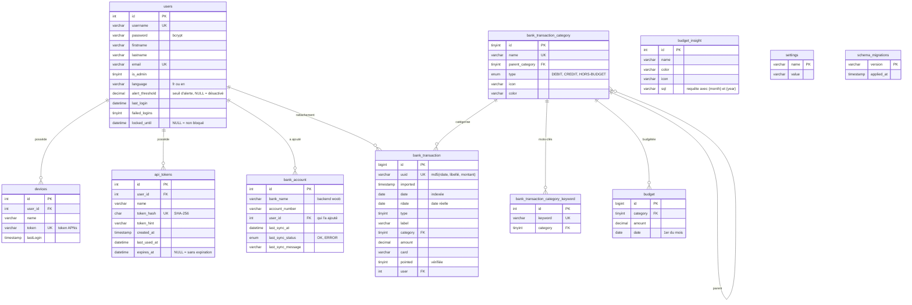

# Modèle de données

Schéma complet : `sql/carbure.sql` (MariaDB/MySQL, InnoDB, `utf8mb4`). Les évolutions
d'une base existante sont dans `sql/migrations/` et appliquées par `Migrator` (voir
[Migrations](#migrations)).

## Tables

| Table | Rôle |
|---|---|
| `users` | Comptes. `is_admin` donne le profil administrateur ; `language` la langue du portail ; `alert_threshold` le montant à partir duquel une nouvelle dépense déclenche une notification (`NULL` = désactivé) ; `last_login` la dernière connexion réussie ; `failed_logins` les échecs de connexion d'affilée et `locked_until` la fin du blocage (24 h après 5 échecs). |
| `devices` | Appareils iOS (token APNs), enregistrés à la connexion. Supprimés avec l'utilisateur. |
| `api_tokens` | Jetons d'accès des agents IA (serveur MCP) : seule l'empreinte SHA-256 (`token_hash`) est stockée, `token_hint` (début du jeton) sert à le reconnaître ; `expires_at` `NULL` = sans expiration. Supprimés avec l'utilisateur. |
| `bank_account` | Comptes bancaires suivis par le foyer : `account_number@bank_name` forme le `bankId` passé à woob. `user_id` est l'utilisateur qui a ajouté le compte (« Ajouté par ») ; `last_sync_at`, `last_sync_status`, `last_sync_message` décrivent la dernière synchronisation. Unicité `(account_number, bank_name, user_id)` ; l'API refuse en plus un compte déjà suivi par le foyer. |
| `bank_transaction` | Transactions. `uuid` unique sert au dédoublonnage ; `user` = premier utilisateur ayant ajouté le compte (`MIN(user_id)`), sans effet sur la visibilité ; suppression de l'utilisateur interdite tant qu'il a des transactions (`ON DELETE RESTRICT`) ; index `transaction_date` sur `date`. |
| `bank_transaction_category` | Catégories hiérarchiques (`parent_category`, `0` = racine). La catégorie `0` « Non catégorisé » (`HORS-BUDGET`) est créée par l'installation et protégée. |
| `bank_transaction_category_keyword` | Règles : mots-clés (en majuscules) recherchés dans les libellés pour catégoriser automatiquement. |
| `budget` | Budget d'une catégorie pour un mois (unique par catégorie et date), en `DECIMAL(10,2)`. |
| `budget_insight` | Insights : requête SQL renvoyant une colonne `amount`, avec les marqueurs `{month}` et `{year}` remplacés par des entiers ; `icon` (icône Material, facultative) et `color` (13 couleurs). |
| `settings` | Réglages modifiés depuis le portail (`mcp_enabled`). |
| `schema_migrations` | Migrations appliquées et leur date ; créée automatiquement par `Migrator` (absente de `sql/carbure.sql`). La version du schéma est la dernière migration enregistrée. |

## Migrations

| Fichier | Contenu |
|---|---|
| `2026-10-03_audit.sql` | `users.is_admin` (l'utilisateur 1 devient administrateur), `users.language`, `devices.token` en `varchar(200)`, clé étrangère `bank_transaction.user` en `ON DELETE RESTRICT` |
| `2026-10-04_alerts.sql` | `users.alert_threshold`, index `transaction_date` sur `bank_transaction.date` |
| `2026-10-05_schema.sql` | `budget.amount` en `DECIMAL(10,2)`, tables en `utf8mb4`, unicité des comptes bancaires |
| `2026-10-06_sync_status.sql` | `bank_account.last_sync_at`, `last_sync_status`, `last_sync_message` |
| `2026-10-07_api_tokens.sql` | Table `api_tokens` |
| `2026-10-08_insight_icon.sql` | `budget_insight.icon` |
| `2026-10-09_settings.sql` | Table `settings` |
| `2026-10-10_last_login.sql` | `users.last_login` |
| `2026-10-11_token_expiry.sql` | `api_tokens.expires_at` |
| `2026-10-12_login_lockout.sql` | `users.failed_logins`, `users.locked_until` |

Chaque migration déclare une ligne `-- applied-if: <requête>` qui permet de reconnaître
une migration déjà appliquée (à la main, ou par `sql/carbure.sql`). Voir
[Développement](developpement.md#migrations-de-base).

## Modèle « foyer »

Toutes les données (comptes, transactions, budgets, catégories, insights) sont partagées
par les utilisateurs. `bank_account.user_id` et `bank_transaction.user` indiquent qui a
ajouté le compte synchronisé, sans restreindre la visibilité. Seuls les appareils, les
jetons d'accès et les préférences (langue, seuil d'alerte) sont propres à chaque
utilisateur.

## Limites connues

- `budget_insight` stocke du SQL exécuté par le serveur : il est encadré (administrateurs
  seulement, mots-clés et tables interdits, transaction en lecture seule), mais des
  indicateurs définis dans le code seraient plus sûrs. Une requête d'insight écrite avec
  `MONTH(date)` / `YEAR(date)` n'utilise pas l'index sur les dates : préférer un intervalle.
