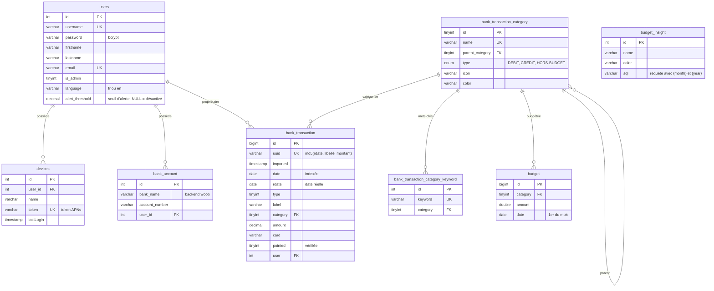

# Modèle de données

Schéma complet : `sql/carbure.sql` (MariaDB/MySQL, InnoDB). Les évolutions pour une
base existante sont dans `sql/migrations/`.

## Tables

| Table | Rôle |
|---|---|
| `users` | Comptes. `is_admin` donne la gestion des utilisateurs ; `language` la langue du portail ; `alert_threshold` le montant à partir duquel une nouvelle dépense déclenche une notification (`NULL` = désactivé). |
| `devices` | Appareils iOS (token APNs), enregistrés à la connexion. Supprimés avec l'utilisateur. |
| `bank_account` | Comptes à synchroniser : `account_number@bank_name` forme le `bankId` passé à woob. Un compte partagé a une ligne par utilisateur. |
| `bank_transaction` | Transactions. `uuid` unique sert au dédoublonnage ; `user` = premier propriétaire du compte ; suppression de l'utilisateur interdite tant qu'il possède des transactions (`ON DELETE RESTRICT`) ; index `transaction_date` sur `date`. |
| `bank_transaction_category` | Catégories hiérarchiques (`parent_category`, `0` = racine / sans catégorie). |
| `bank_transaction_category_keyword` | Mots-clés recherchés dans les libellés pour catégoriser automatiquement. |
| `budget` | Budget d'une catégorie pour un mois (unique par catégorie et date). |
| `budget_insight` | Indicateurs : requête SQL renvoyant une colonne `amount`, avec les marqueurs `{month}` et `{year}` remplacés par des entiers. |

## Migrations

| Fichier | Contenu |
|---|---|
| `2026-10-03_audit.sql` | `users.is_admin` (l'utilisateur 1 devient administrateur), `users.language`, `devices.token` en `varchar(200)`, clé étrangère `bank_transaction.user` en `ON DELETE RESTRICT` |
| `2026-10-04_alerts.sql` | `users.alert_threshold`, index `transaction_date` sur `bank_transaction.date` |

## Modèle « foyer »

Toutes les données (transactions, budgets, catégories, analyses) sont partagées par les
utilisateurs. La colonne `bank_transaction.user` indique le propriétaire du compte
synchronisé, sans restreindre la visibilité.

## Limites connues

Reprises de `TODO.md` (section *Base de données*) :

- `bank_transaction.date` est indexée et `GET /transaction` et les tendances filtrent
  par intervalle de dates ; `Budget::get`, les insights et le compteur de transactions
  non pointées utilisent encore `MONTH(date)` / `YEAR(date)`, ce qui empêche l'usage de
  l'index.
- `Budget::get` combine un `OR` et une sous-requête par catégorie : à réécrire avec une
  agrégation unique du mois.
- `budget.amount` est en `double` (à passer en `DECIMAL(10,2)`) ; tables en `utf8`
  (à passer en `utf8mb4`).
- Pas d'unicité `(account_number, bank_name, user_id)` sur `bank_account`.
- La catégorisation recharge tous les mots-clés pour chaque transaction (N+1).
- `budget_insight` stocke du SQL exécuté tel quel : à remplacer par des indicateurs
  définis dans le code.
